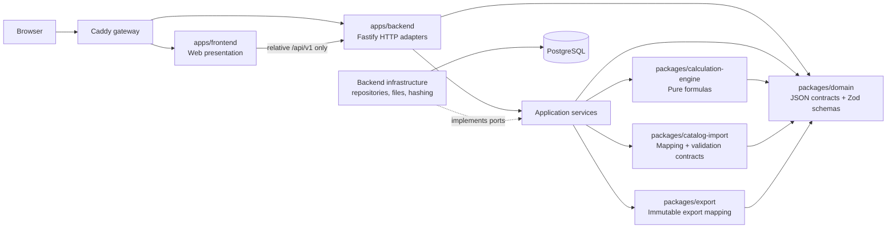

# Allowed dependency direction

The dashed arrow is dependency inversion: infrastructure depends on application port definitions.
The application layer does not import PostgreSQL implementations. No arrow may point from the
calculation engine to web, application, infrastructure, database, import, or export modules.
