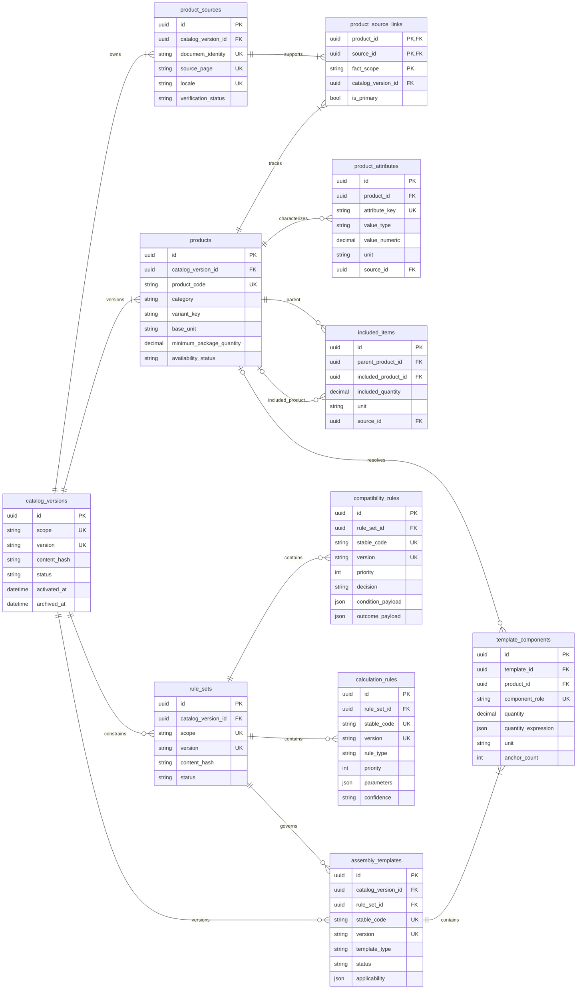
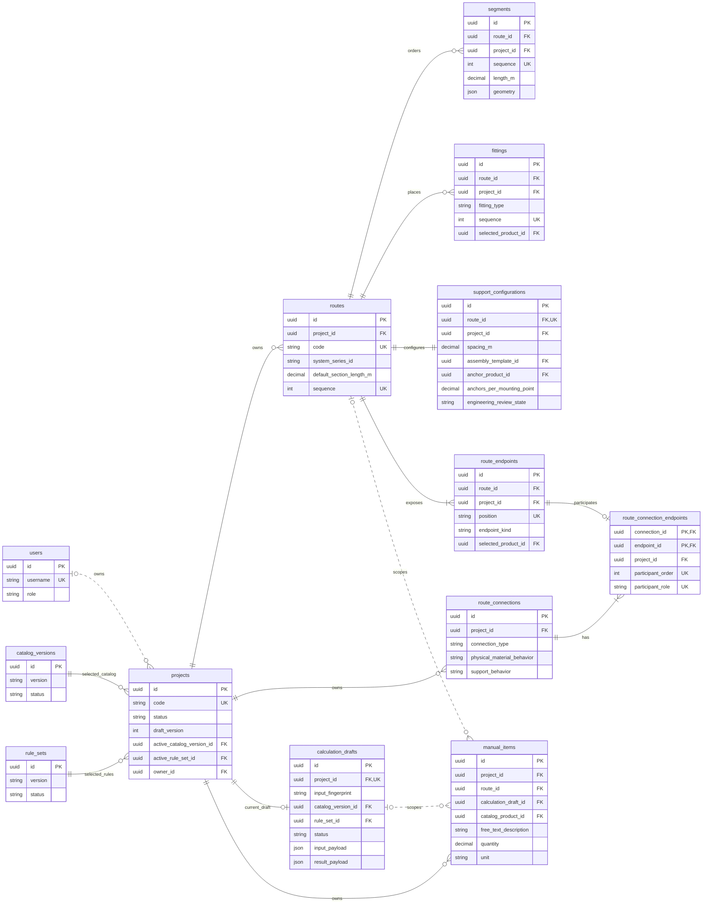
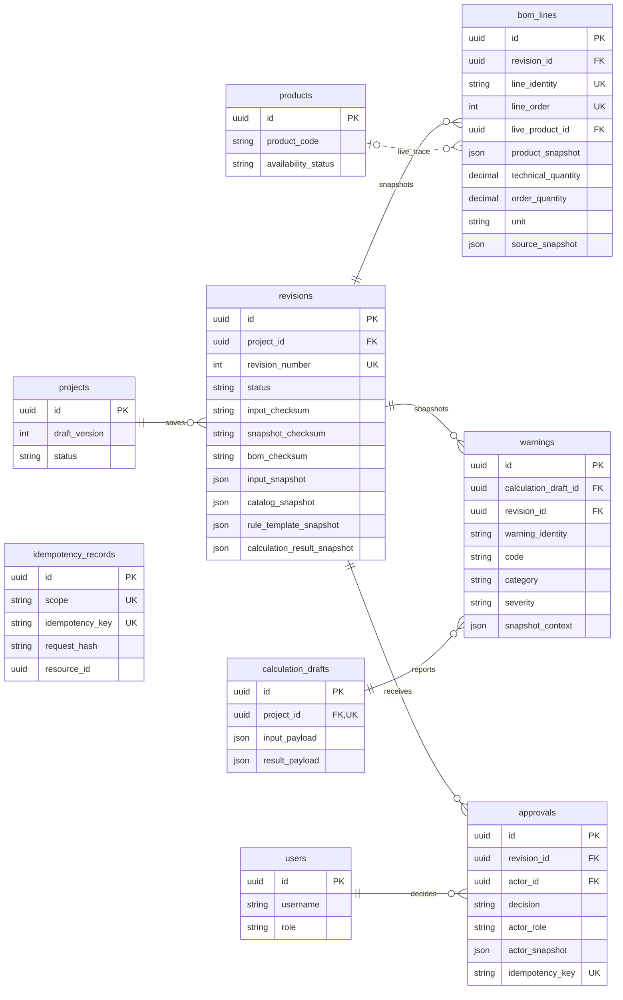

# Stage 4 ER model

This model describes the Stage 4 migrations `20260816010000_stage4_data_model.sql` and
`20260816020000_restrict_saved_bom_product_deletion.sql`. It is split by ownership boundary so that
keys and cardinalities remain readable. PostgreSQL column definitions and every index/check are
authoritative in the migrations.

## Catalog, rules, and assembly templates

`catalog_versions` and `rule_sets` are managed release identities. A partial unique index permits
one active row per scope. Product codes are case-insensitively unique only inside a catalog version;
the same code may occur in another release. Products require at least one source link at transaction
commit. Product/source and template/product composite foreign keys prevent facts from silently
crossing catalog versions.

## Mutable project input and calculation draft

Project input rows and the single calculation draft are mutable. Route code uniqueness is
case-insensitive and scoped to `project_id`. Deferred constraint triggers require exactly one start
and one end endpoint for every route and the correct two/three endpoint cardinality for every
connection. Composite `(id, project_id)` foreign keys make cross-project connections impossible.
An endpoint can belong to at most one connection. Manual items use an exclusive-or check between a
catalog product and free text.

## Saved revision and snapshot boundary

The transaction that creates `revisions` is the snapshot boundary. It locks the project, assigns
the next per-project revision number, and writes the validated calculation input, resolved catalog
facts/sources/attributes/included items, effective rules/templates/components, complete calculation
result, normalized BOM lines, and warnings. The three checksums cover input, catalog/rule snapshot,
and BOM respectively.

Revision lifecycle columns may transition from Calculated to Checked to Approved and finally to
Archived. A database trigger rejects changes to all payload, identity, provenance, and checksum
columns. BOM lines, revision warnings, and approval events are append-only. The persistence adapter
does not expose update/delete operations for immutable content.

## Delete and archival behavior

- Catalogs, rule sets, and products used by projects or saved BOM rows use `RESTRICT`; they are
  archived rather than deleted. The complete product snapshot remains independently available.
- Mutable route children cascade only when their owning route/project is deleted. A connected route
  cannot disappear silently because connection participants restrict endpoint deletion.
- Revisions, BOM lines, saved warnings, and approvals cannot cascade from project deletion and are
  protected from update/delete by triggers.
- Draft warnings and draft-scoped manual items cascade with the replaceable calculation draft.
